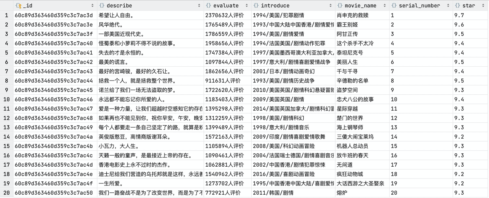

# douban-crawler
利用Python的Scrapy框架爬取豆瓣电影信息，项目添加了user-agent和proxy代理两种方式来进行爬虫隐藏。

## Quick Start

### 启动应用
```shell
pip install -r requirements.txt
```
然后运行__init__.py文件即可

### 应用截图



### 

## scrapy框架组成


### 各部分组成

- Scrapy Engine：中心引擎，负责通讯，信号，传输数据等
- Downloader：下载器，下载引擎发送的所有请求，并将其获取到的response交还给引擎
- Scheduler：调度器，接受引擎发送过来的请求，并按照一定的方式进行整理排列入队，当引擎需要时交还给引擎
- Spider：负责处理所有response，从中分析提取数据，获取Item字段需要的数据，并将需要跟进的新的URL提交给引擎，进一步爬取
- Item Pipeline：负责处理Spider中获取到的Item，并进行进行后期处理（详细分析、过滤、存储等）
- Downloader Middlewares：可以自定义扩展或封装下载功能的组件
- Spider Middlewares：可以自定义扩展和操作Spider和Engine之间的URL请求的组件

### 数据流

数据流如图所示

## MongoDB数据库安装

### OSX安装MongoDB

```shell
brew tap mongodb/brew
brew install mongodb-community@4.4
# @后为版本
```

### MongoDB使用注意

MongoDB中的数据库不是实时创建的，需要在插入了文档后，才能够生效（show dbs才能查询到）

## 